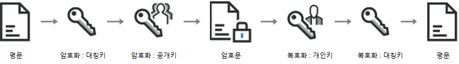

# CapstoneDesign
## Global_Rounge_Door_System

### 암호화 기법 [RSA + AES]

 + RSA : 공개 키 암호방식  
장점 : 보안성이 뛰어남  
단점 : 길이제한, 속도 느림

 + AES : 대칭 키 암호방식  
장점 : 길이제한x, 속도 빠름  
단점 : 대칭 키 

+ Encryption 사용방법 ( RSA와 AES의 장점만을 이용 )
1. Server : RSA Key Pair를 생성
2. Server : public Key를 Client로 전송
3. Client : 평문을 AES로 암호화 (symmetric_key)
4. Client : 암호화된 평문을 RSA로 암호화 (public_key)
5. Client : 두 번 암호화된 평문을 서버로 전송
6. Server : 암호화된 평문을 RSA로 복호화 (private_key)
7. Server : 암호화된 평문을 AES로 복호화 (symmetric_key) - 복호화 완료

