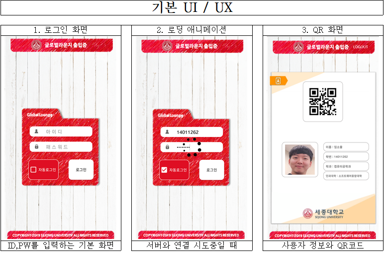
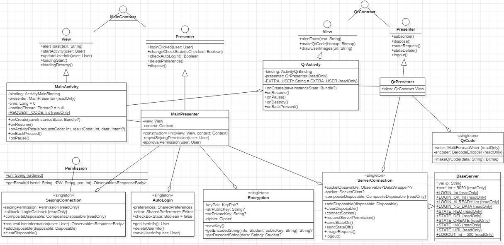

# CapstoneDesign [ Global_Rounge_Door_System ]
### MVP 패턴을 적용한 안드로이드 프로젝트

<hr/>  

### 앱 화면  


 

## [ Contract ]
 ### 1. 로그인 화면 [ MainJob ](https://github.com/zojae031/CapstoneDesign_Global_Rounge_Door_System/blob/android/GlobalRounge/app/src/main/java/capstonedesign/globalrounge/mainjob)
  
 #### [MainPresenter](https://github.com/zojae031/CapstoneDesign_Global_Rounge_Door_System/blob/android/GlobalRounge/app/src/main/java/capstonedesign/globalrounge/mainjob/MainPresenter)  
 #### 학교 인증정보를 받아옴
 ```kotlin
    private fun requestSejongPermission(user: User) {
        SejongConnection.requestUserInformation(user, object : SejongConnection.LoginCallback {
            override fun approval(user: User) {
                approvalPermission(user)//인증 후 한번 더 서버인증
            }

            override fun reject(text: String) {
                view.loadingDestroy()
                view.alertToast(text)
            }
        })
    }
 ```
 
 #### 서버 인증정보를 받아옴
 ```kotlin
    private fun approvalPermission(user: User) {
        view.loadingStart()
        ServerConnection.connectSocket()

        val ref = ServerConnection.socketObservable!!
            .observeOn(AndroidSchedulers.mainThread())
            .doOnError { t -> view.alertToast("에러띠!${t.printStackTrace()}") }//TODO 추가된 socketCloseException
            .subscribe(object : SocketSubscriber() {
                override fun onConnected() {
                    Encryption.newKey()
                    ServerConnection.requestServerPermission(user)
                }

                override fun onDisconnected() {
                    view.loadingDestroy()
                    view.alertToast("연결이 원활하지 않습니다.")
                }

                override fun onResponse(data: ByteArray) {
                    val str = String(data, StandardCharsets.UTF_8)
                    try {
                        (JsonParser().parse(str) as JsonObject).let { jsonObject ->
                            when (jsonObject.get("seqType").asInt) {
                                LOGIN_OK -> {
                                    Encryption.getDecodedString(jsonObject.get("data").asString).let { string ->
                                        AutoLogin.saveUserInfo(user)//체크박스에 따른 자동로그인 저장
                                        (Gson().fromJson<Any>(string, Student::class.java) as Student).let {
                                            view.startActivity(it)
                                        }
                                    }
                                }
                                LOGIN_ALREADY -> {
                                    view.alertToast("이미 로그인 중입니다.")
                                }
                                LOGIN_NO_DATA -> {
                                    view.alertToast("서버에 더미데이터가 없습니다.")
                                }
                            }
                        }
                    } catch (e: ClassCastException) {
                        e.printStackTrace()
                    } finally {
                        view.loadingDestroy()
                    }
                }
            })
        ServerConnection.addDisposable(ref)
    }
 ```
 <hr>  
 
 ### 2. QR코드 화면 [ QrJob ](https://github.com/zojae031/CapstoneDesign_Global_Rounge_Door_System/blob/android/GlobalRounge/app/src/main/java/capstonedesign/globalrounge/qrjob)
  
 
 ##### 데이터 바인딩을 이용하여 user 데이터 삽입 [ activity_qr.xml ](https://github.com/zojae031/CapstoneDesign_Global_Rounge_Door_System/blob/android/GlobalRounge/app/src/main/res/layout/activity_qr.xml)
 
 
 ```xml
     <data>
        <variable name="user" type="capstonedesign.globalrounge.dto.Student"/>
    </data>
 ```    
 ```xml
 <TextView
 android:text="@{@string/user_name(user.name)}"
 />
 ...
 <TextView
 android:text="@{@string/user_id(user.studentID)}"
 />
 ...
 <TextView
 android:text="@{@string/user_department(user.department)}"
 />
 ...
 <TextView
 android:text="@{@string/user_college(user.college)}"
 />
 ```
 
 ##### [QrActivity](https://github.com/zojae031/CapstoneDesign_Global_Rounge_Door_System/blob/android/GlobalRounge/app/src/main/java/capstonedesign/globalrounge/qrjob/QrActivity.kt)  
 
 ```kotlin
 (intent.getSerializableExtra(EXTRA_USER) as Student).let { binding.user = it }
 
 ```
 
#### 서버와 통신하는 부분 [QrPersenter](https://github.com/zojae031/CapstoneDesign_Global_Rounge_Door_System/blob/android/GlobalRounge/app/src/main/java/capstonedesign/globalrounge/qrjob/QrPresenter.kt)
 ```kotlin
    override fun subscribe() {
        var buffer = ""
        val ref = ServerConnection.socketObservable!!.observeOn(AndroidSchedulers.mainThread())
            .subscribe(object : SocketSubscriber() {
                override fun onConnected() {

                }

                override fun onDisconnected() {

                }

                override fun onResponse(data: ByteArray) {
                    val str = String(data, StandardCharsets.UTF_8)
                    try {
                        (JsonParser().parse(str) as JsonObject).let {
                            when (it.get("seqType").asInt) {
                                STATE_CREATE -> {
                                    QrCode.makeQrCode(it.get("qr").asString).let { bitmap ->
                                        view.makeQrCode(bitmap)
                                    }
                                }
                            }
                        }

                    } catch (e: JsonSyntaxException) {
                        buffer += str
                        if (buffer[buffer.length - 1] == '\n') {
                            makeUserImages(Base64.decode(buffer, Base64.DEFAULT))
                            buffer = ""
                        }
                    } catch (e: ClassCastException) {
                        e.printStackTrace()
                    }
                }
            })
        ServerConnection.image_request()
        ServerConnection.addDisposable(ref)
    }
 ```
 
 
 <hr>  
 
## (Model)  
 
#### Permission
 + 학교 서버 우회접근[SejongPermission.kt](
 https://github.com/zojae031/CapstoneDesign_Global_Rounge_Door_System/blob/android/GlobalRounge/app/src/main/java/capstonedesign/globalrounge/model/permission/SejongConnection.kt) `Retrofit2`
 ```kotlin
     private interface Permission {

        @POST(url)
        fun getResult(@Query("rUserid") rUserid: String, @Query("rPW") rPW: String, @Query("pro") pro: Int): Call<ResponseBody>

        companion object {
            const val url = "https://udream.sejong.ac.kr/main/loginPro.aspx/"
        }
    }
    
        fun requestUserInformation(user: User, callback: LoginCallback) {
        sejongPermission.getResult(user.id, user.pw, 1)
            .enqueue(object : Callback<ResponseBody> {
                override fun onResponse(call: Call<ResponseBody>, response: Response<ResponseBody>) {

                    response.body()!!.string().let {
                        if (it.contains("alert")) {//없는정보
                            if (it.contains("패스워드")) {
                                callback.reject("패스워드가 잘못 되었습니다.")
                            } else if (it.contains("아이디")) {
                                callback.reject("아이디가 잘못 되었습니다.")
                            }
                        } else {//있는정보
                            callback.approval(user)
                        }
                    }


                }

                override fun onFailure(call: Call<ResponseBody>, t: Throwable) {
                    Log.e("RequestPermission Error", "무언가 잘못되었군")
                }
            })

    }
 ```
 
 + DB서버 접근[ServerPermission.kt](https://github.com/zojae031/CapstoneDesign_Global_Rounge_Door_System/blob/android/GlobalRounge/app/src/main/java/capstonedesign/globalrounge/model/permission/ServerConnection.kt)``Rx (CoddestX)``
 
 #### Util  
 + 자동로그인  [ AutoLogin ](https://github.com/zojae031/CapstoneDesign_Global_Rounge_Door_System/blob/android/GlobalRounge/app/src/main/java/capstonedesign/globalrounge/model/AutoLogin.kt)``SharedPreference``
 + QRCode 생성  [ QrCode ](https://github.com/zojae031/CapstoneDesign_Global_Rounge_Door_System/blob/android/GlobalRounge/app/src/main/java/capstonedesign/globalrounge/model/QrCode.kt) ``Zxing``
 + 암호화  [ Encryption ](https://github.com/zojae031/CapstoneDesign_Global_Rounge_Door_System/blob/android/GlobalRounge/app/src/main/java/capstonedesign/globalrounge/model/Encryption.kt) ``RSA / Base64``
<hr>


### 전체 안드로이드 클래스 다이어그램



### 사용된 라이브러리
+ Kotlin
+ RxJava
+ Retrofit2
+ Gson
+ coddestX
+ Zxing
