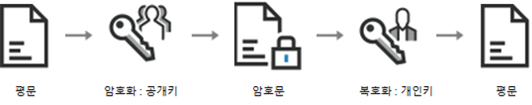
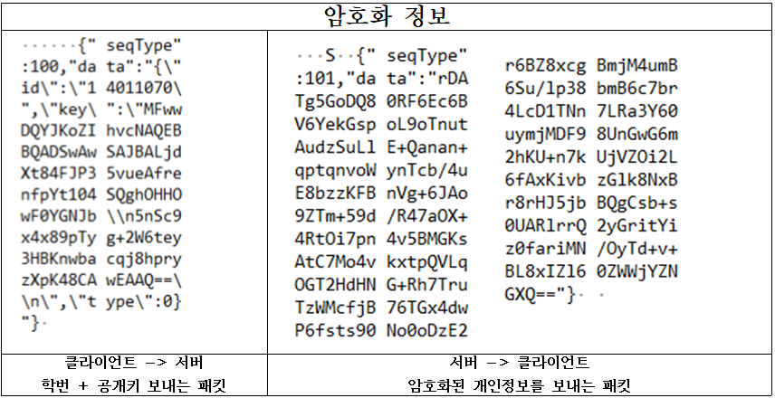

# CapstoneDesign
## Global_Rounge_Door_System

### 암호화 기법 [RSA]

 + RSA : 공개 키 암호방식  
장점 : 보안성이 뛰어남  
단점 : 길이제한, 속도 느림

+ Encryption 사용방법 ( RSA와 AES의 장점만을 이용 )
1. Client : RSA Key Pair를 생성
2. Client : public Key를 Server로 전송
3. Server : 평문을 RSA로 암호화 (public_key) : encryption
4. Server : 암호화된 평문을 Client로 전송
5. Client : 암호화된 평문을 RSA로 복호화 (private_key) : decryption

    
 

